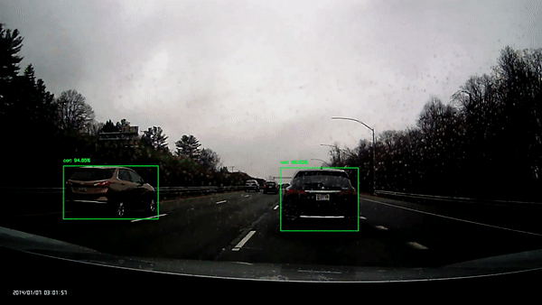

# Tesloyta
## Real-Time Object Detection on the Road with RaspberryPi 4


## Introduction

The goal of this project is to do real-time object detection and explore solutions to a lot of edge cases to make autonomous cars a reality. The project is currently under production to make it a simple downloadable project that can be ran on any embedded device or small single-board computers like Raspberry Pi. After experimenting with the pipeline we were able to deploy a SqueezeDet model trained on KITTI dataset. The accompanying blogpost[https://hira63s.github.io/2020-06-20-SqueezeDet-For-Real-Time-Object-Detection-On-The-Road/] provides more details about the training process and deployment. The model is built on top of the awesome work done by Qui Jueqin and the team, here[https://github.com/QiuJueqin/SqueezeDet-PyTorch]. My implementation is built on their work with a lot more functionality added.

## Model


<!-- Github Markdown -->

<!-- Code Blocks -->
```python
python RaspberryPi/PyScripts/MobileNet_Detection/real_time_object_detection.py --output test.avi --prototxt MobileNetSSD_deploy.prototxt.txt --model MobileNetSSD_deploy.caffemodel
```

## Research
One major blocker in getting the project completed and functioning was the inference time. Because of the compute limitations, a smaller model with higher mAP (mean Average Precision) was needed. Both SqueezeNet and MobileNet are ideal for Computer Vision applications while using devices like RaspberryPi. However, not only do they models need to be trained on datasets specific to objects on the road but they also need to use better and more accurate object detectors so that even the smaller objects get noticed. There is a need to take care of all the edge cases as well when it comes to real-time inference by autonomous cars on the road. Multiple different models with newer techniques like DETR are being researched and the current work being done can be found in Models folder.

### Next Steps:
The deployed MobileNet model was trained on COCO dataset but currently, a model that would be trained on dataset specific to objects on the road is under production. We are using Argoverse 3D object tracking dataset to train a model using latest detection techniques. The repository will be updated on a regular basis with latest work.
